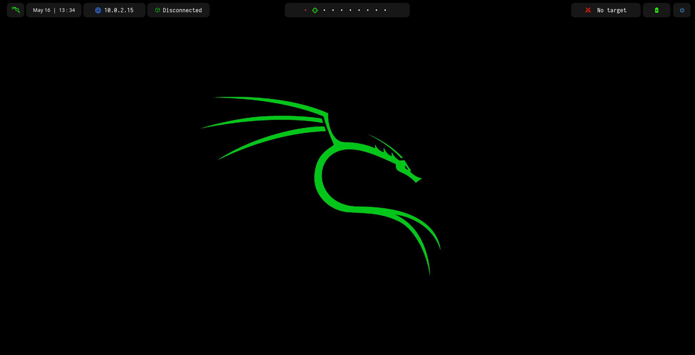
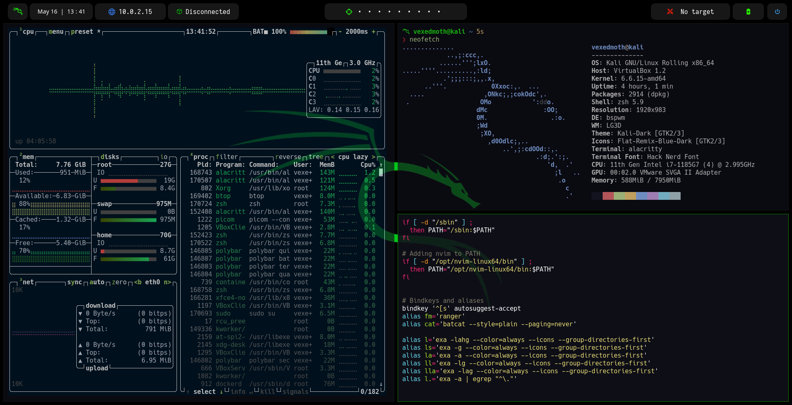

# auto-kalivex

<meta name="name" content="vexedmoth">
<meta name="description" content="This is an auto installation of Kali Linux for Pentesting and Offensive Security. You need to install a clean Kali Linux system before executing this">
<meta name="copyright" content="vexedmoth 2024">
<meta name="keywords" content="auto-bspwm, auto-install, kali, kali linux, auto bspwm, auto kali, auto installation, kali linux automatic installation ...">


```

                           __                __  __  
 _   _____  _  _____  ____/ /___ ___  ____  / /_/ /_ 
| | / / _ \| |/_/ _ \/ __  / __ `__ \/ __ \/ __/ __ \ 
| |/ /  __/>  </  __/ /_/ / / / / / / /_/ / /_/ / / /
|___/\___/_/|_|\___/\__,_/_/ /_/ /_/\____/\__/_/ /_/  github.com/vexedmoth
                                                     
```




> [!NOTE]  
> This is an auto installation of Kali Linux for Pentesting and Offensive Security. You need to install a clean Kali Linux system before executing this

> [!WARNING]
> Avoid enable 3D acceleration using VirtualBox


## Installation
1. Update and upgrade packages
    
    ```shell
    sudo apt update && sudo apt upgrade -y
    ```

2. Clone this repo, grant permissions and execute the script

    ```shell
    git clone https://github.com/vexedmoth/auto-kalivex.git
    cd auto-kalivex
    chmod +x autoinstall.sh
    ./autoinstall.sh
    ```

3. After the installation, the system will be rebooted. Then, select `bspwm` as the window manager and log in

4. Run `nvim` to check if configuration of `NvChad` is correct.

    If there is no problem, then after `lazy.nvim` finishes downloading plugins type:
   ```vim
   :MasonInstallAll
   ```

    Else, install it from zero:
   ```shell
   rm -rf ~/.config/nvim
   git clone https://github.com/NvChad/starter ~/.config/nvim && nvim
   ```
   ```vim
   :MasonInstallAll
   ```

5. Configure the Github [SSH keys](https://docs.github.com/en/authentication/connecting-to-github-with-ssh/generating-a-new-ssh-key-and-adding-it-to-the-ssh-agent) in order to enable backups using `dotsup` file
    - Once this is done, fork this repo, clone it into your system and **keep it without changing any file**.
    - By executing `dotsup` in your terminal your config files will be automatically backed up on your own GitHub repo.
    
7. Clone your own `Obsidian` repo and link it
8. Install super h4ck3er packages like `Burpsuite Pro`


